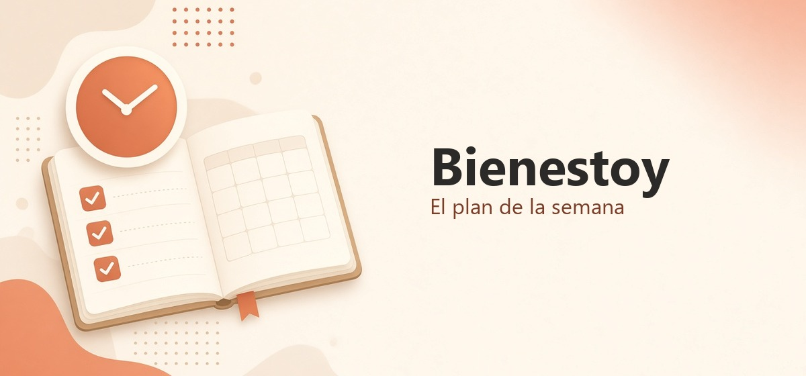

# Bienestoy



App personal para ver el **plan de la semana** (lunes a domingo) y si se cumplió. Un día puede tener varias actividades; en Hoy cada una se marca hecha. Un día sin plan es **Descanso**. El peso y las medidas van al lado, no mandan.

Sin cuenta ni nube. Los datos viven en este dispositivo.

**Usar:** [martamacfly.github.io/Bienestoy](https://martamacfly.github.io/Bienestoy/)

## Qué hace

- **Hoy** — las actividades del día, cada una con un check si está hecha; si no hay plan, día de descanso. Se puede añadir otra actividad (con repeticiones o tiempo). Contador HIIT. Se puede deslizar a días anteriores (no al futuro). Atajo a Cuerpo de ese día.
- **Semana** — el plan de cada día (una o varias actividades y sus ejercicios, o Descanso). Al editar se añaden actividades y se cambian los ejercicios, y se puede copiar la semana anterior. Cualquier día se puede apuntar.
- **Catálogo** — actividades y ejercicios, con repeticiones o tiempo.
- **Resumen** — tarta de la semana (días con y sin deporte), actividades hechas (con tiempo o repeticiones) y cuerpo. Se puede deslizar a semanas anteriores (no al futuro).
- **Cuerpo** — pesaje (kg) y medidas fijas: cintura, brazo y cadera (cm).
- **Ajustes** — exportar e importar una copia JSON, ver cuándo fue la última copia, instalar la app y empezar de cero.

No es un programa de gym, ni un tracker de duración, ni una app de hábitos.

## Instalar en el teléfono

Ábrela en el navegador e instálala como app. Así se usa a pantalla completa y sigue funcionando sin red.

### iPhone o iPad (Safari)

1. Entra en [Bienestoy](https://martamacfly.github.io/Bienestoy/).
2. Pulsa el botón de compartir.
3. Elige **Añadir a pantalla de inicio**.

Chrome u otro navegador en iOS no instala igual de bien; usa Safari.

### Android (Chrome)

1. Entra en [Bienestoy](https://martamacfly.github.io/Bienestoy/).
2. En el menú, elige **Instalar aplicación** o **Añadir a pantalla de inicio**.

Usa siempre el mismo teléfono y el mismo navegador. Si borras datos del navegador o cambias de dispositivo, el historial se pierde salvo que hayas exportado una copia en Ajustes.

Si ya la tienes instalada y no ves un cambio, cierra la app y ábrela otra vez; a veces Safari o Chrome tardan un poco en traer la versión nueva.

## Desarrollar

Hace falta Node.js.

```bash
npm install
npm run dev
```

La app queda en `http://localhost:5173/`. Tests: `npm test`.
